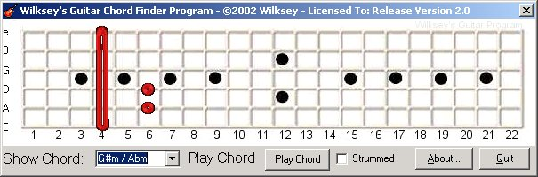



## Guitar Chord Finder V2\.0\! NOW WITH MIDI\!\!\!

### Description

Version 2.0!! NOW WITH MIDI PLAYBACK, Can Pick Or Strum!!!!

I Have used, not copied as i already had most of it done, Frederick J. Benjamin's RiffMaster 2 idea, mainly for ease of use, I have programmed it myself, the way he programmed the midi inspired mine tho!

ALSO! NOW USES DATABASE! U WILL NEED TO REFERENCE DAO 3.6 AND IT IS AN ACCESS 2000 DATABASE!

MIDI Uses just the MIDI Mapper for now!
 
### More Info
 
Guitar Chord

A Basic knowledge of how a guitar works.

Visual and Audio Feedback

The laster frets when barred look wobbly/misaligned, will fix in next ver, too tired to do it now, its 2:18am!

             |
---                |---
**Submitted On**   |2002-07-18 02:11:46
**By**             |[Wilksey\!](https://github.com/Planet-Source-Code/PSCIndex/blob/master/ByAuthor/wilksey.md)
**Level**          |Intermediate
**User Rating**    |5.0 (30 globes from 6 users)
**Compatibility**  |VB 6\.0
**Category**       |[Miscellaneous](https://github.com/Planet-Source-Code/PSCIndex/blob/master/ByCategory/miscellaneous__1-1.md)
**World**          |[Visual Basic](https://github.com/Planet-Source-Code/PSCIndex/blob/master/ByWorld/visual-basic.md)
**Archive File**   |[Guitar\_Cho10746471720\.zip](https://github.com/Planet-Source-Code/wilksey-guitar-chord-finder-v2-0-now-with-midi__1-37011/archive/master.zip)

### API Declarations

See Code!

